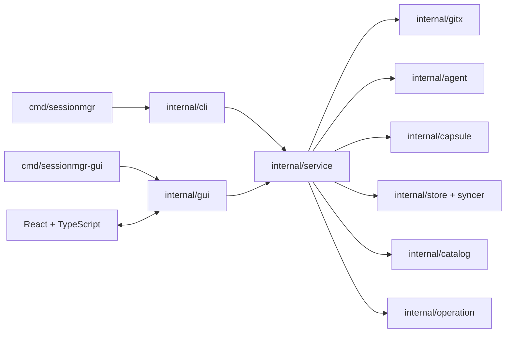

# Session Manager GUI 实现规划

> 目标版本：`v0.2.0-dev`
> 状态：Planned
> 规划日期：2026-07-30
> 实现分支：`codex/gui-implementation-plan`
> 配套验收文档：[GUI_ACCEPTANCE.md](./GUI_ACCEPTANCE.md)

## 1. 结论

GUI 将实现为一个本地桌面应用：

- 桌面壳：Wails v2 稳定版；
- 后端：现有 Go domain、Git、Capsule、Store 和 adapter；
- 前端：React + TypeScript + Vite；
- 新入口：`cmd/sessionmgr-gui/`；
- 现有 `sessionmgr` CLI 继续保留；
- CLI 和 GUI 必须调用同一个 typed service 层，不能复制业务逻辑；
- 第一阶段继续支持 macOS 和 Linux，Windows 后续验证；
- production GUI 不启动 localhost 服务，不依赖托管后端，不改变本地优先原则；
- 现有 CLI 继续保持 `CGO_ENABLED=0` 的独立构建；GUI 使用单独的 Wails
  platform toolchain，不能把 WebView/desktop 依赖泄漏进 CLI binary。

选择 Wails v2 的主要原因：

1. 当前产品后端已经是 Go，Wails 可以直接绑定 Go service；
2. Wails 能生成 Go struct 对应的 TypeScript bindings；
3. Wails 提供原生目录/文件对话框和 Go↔JavaScript 事件系统；
4. 它使用系统 WebView，不需要随应用打包完整 Chromium；
5. Wails v3 截至规划日仍明确标记为 alpha/pre-release，因此先使用 v2
   稳定线，Phase 5 再评估迁移。

参考：

- [Wails v2 development and Go bindings](https://wails.io/docs/gettingstarted/development/)
- [Wails v2 Go/JavaScript events](https://wails.io/docs/reference/runtime/events/)
- [Wails v2 native file dialogs](https://wails.io/docs/v2.12.0/reference/runtime/dialog/)
- [Wails v3 status](https://v3.wails.io/)

## 2. GUI 的产品目标

GUI 的第一目标不是替换 CLI，而是让开发者可以可视化、可验证地完成
Session Manager 的核心流程。

### 2.1 用户目标

- 不记命令即可 capture、verify、restore、handoff、push 和 pull；
- 在任何写操作发生前看清楚文件、大小、安全发现和目标路径；
- 能快速回答“这个 Run 保存了什么、验证过什么、是否可以恢复”；
- 每次操作结束后能看到机器可读报告和人类可读结果；
- 实验能力、降级状态和失败状态有明显且一致的视觉区别；
- 开发版本可以一键进入隔离验收环境，不污染真实 `~/.sessionmgr`。

### 2.2 工程目标

- CLI 和 GUI 行为一致；
- UI 关闭、刷新或崩溃不会破坏正在进行的原子操作；
- 长操作可观察、可取消、可重试；
- GUI 不获得超出 service API 的文件系统权限；
- 前端不接触明文密钥、完整秘密、认证数据库或未脱敏日志；
- 所有用户可见结论都能回到 manifest、checkpoint、event 或 operation
  report。
- GUI build failure 不能阻止 CLI build、test 或 release。

### 2.3 非目标

`v0.2.0-dev` 不包含：

- 多用户和团队权限；
- 托管云服务；
- 浏览器远程访问；
- 实时协作；
- 原始 session 编辑；
- Agent 登录或凭据迁移；
- Windows 正式支持；
- 自动升级；
- 任意 Agent session replay；
- GUI 内置终端。

## 3. 目标用户流程

### 3.1 首次启动

1. GUI 检查 Session Manager home、Git、Codex state 和 age identity。
2. 缺少本地初始化时显示 Setup 页面。
3. 用户点击 Initialize。
4. GUI 只显示 public age recipient，不显示 identity。
5. 完成后进入 Overview。

### 3.2 Capture Wizard

Capture 必须分为“只读预检”和“确认后执行”两个阶段。

1. 选择 Git workspace；
2. 展示 repo、branch、HEAD、upstream 和特殊 Git 状态；
3. 展示匹配的 Codex sessions，用户明确选择一个；
4. 展示：
   - 本地 commit 数量；
   - staged/unstaged 文件；
   - untracked 文件数量和大小；
   - 显式 ignored patterns；
   - submodule/LFS/shallow/sparse warnings；
5. 运行 secret scan，按 block/warn/info 分类；
6. 用户填写标题并确认清单；
7. 后端重新验证预检 token，防止预检与执行之间 workspace 发生变化；
8. 执行 capture，逐阶段显示状态；
9. 完成页显示 Run ID、digest、报告路径以及可选 Push 操作。

预检不能发布 object ref，也不能改写 Git workspace。允许产生的临时只读扫描缓存
必须可以安全丢弃。

### 3.3 Run 浏览与详情

Runs 页面支持：

- repo、Agent、machine、tag、integrity、日期筛选；
- 搜索标题、Run ID 和 native session ID；
- 分页或虚拟列表，不能一次加载全部 event/object；
- integrity、security、sync 和 native capability 状态列；
- lineage 入口。

Run Detail 包含以下 tabs：

1. Overview：目标、repo、branch、HEAD、machine、runtime；
2. Changes：commit、staged、unstaged、untracked 文件；
3. Session：规范化 event timeline；
4. Checkpoints：session position 与 workspace digest；
5. Security：masked finding、规则、来源和处理建议；
6. Provenance：objects、checksums、capabilities 和 manifest；
7. Operations：capture、verify、restore、push/pull 历史。

默认不展示 raw session 正文。开发模式下的 raw 查看必须二次确认、默认脱敏、限制
单次读取大小，并明确提示它可能包含敏感内容。

### 3.4 Verify

1. 用户在 Run Detail 点击 Verify；
2. 选择 quick 或 deep；
3. 进度显示 manifest、required objects、size 和 checksum 阶段；
4. 结果明确显示 verified 或 failed；
5. 失败时显示 object digest 和下一步，但不显示 payload 内容；
6. operation report 可打开或复制路径。

### 3.5 Restore Wizard

1. 选择目标 repository；
2. GUI 自动建议隔离 worktree 路径和 restore branch；
3. 运行只读 preflight：
   - schema/capability；
   - required objects；
   - repository identity；
   - HEAD 可达性/bundle；
   - 目标路径；
   - filesystem path/case/symlink capability；
4. 用户选择是否尝试实验性 native session restore；
5. 最终确认页突出显示：
   - 将创建的 worktree；
   - 将创建的 branch；
   - 不会修改当前 dirty workspace；
   - native restore 的 experimental 标签；
6. 执行 restore；
7. 完成后显示 expected/actual digest；
8. native restore 失败但 handoff 成功时显示 Degraded，而不是 Success；
9. 提供 Open Worktree、Reveal Handoff 和 Copy Resume Command。

### 3.6 Handoff

- 在 Run Detail 预览确定性 Markdown；
- 清晰区分 Fact、Inferred 和 Suggested；
- 没有验证证据时必须显示“未找到结构化验证证据”；
- 支持 Save As 和 Copy；
- 不允许前端自行总结并把推断写成事实。

### 3.7 Store 和同步

Stores 页面支持：

- 列出 file/SSH Stores；
- 添加、编辑、测试连接；
- 复制本机 public age recipient；
- 不读取或展示 private identity；
- Push 单个或选中的 Runs；
- Pull 并显示新增、已存在和冲突数量；
- 显示 object/capsule、verify、ref publish 阶段；
- block finding 存在时禁用 SSH Push 并解释处理方式；
- 网络中断后显示 Retry，复用现有 immutable data。

### 3.8 Operations

Operations 页面是 GUI 验收的证据中心：

- 展示 operation ID、类型、Run、阶段、状态、开始/结束时间；
- supported、experimental、unsupported、failed、degraded 使用固定视觉语义；
- 可以打开对应 report；
- 可以复制 sanitized diagnostic summary；
- 可以对可重试操作执行 Retry；
- 应用重启后仍能从 operation reports 重建历史状态。

## 4. 信息架构

```text
Session Manager
├── Overview
│   ├── Environment health
│   ├── Recent Runs
│   ├── Pending/failed operations
│   └── Store status
├── Runs
│   ├── Catalog
│   ├── Run Detail
│   ├── Capture Wizard
│   ├── Restore Wizard
│   └── Handoff
├── Operations
├── Stores
└── Settings
```

主窗口建议：

```text
┌──────────────────────────────────────────────────────────────────┐
│ Session Manager                         [Capture] [Pull] [Health] │
├───────────────┬──────────────────────────────────────────────────┤
│ Overview      │ Page title                          Page actions │
│ Runs          │ ──────────────────────────────────────────────── │
│ Operations    │                                                  │
│ Stores        │ Main content                                     │
│ Settings      │                                                  │
│               │                                                  │
├───────────────┴──────────────────────────────────────────────────┤
│ Active operation · phase · status · [Open] [Cancel when safe]    │
└──────────────────────────────────────────────────────────────────┘
```

窗口最小尺寸暂定 `1100 × 720`，内容在 `1440 × 900` 完成主要验收。布局必须支持
键盘操作和至少 200% UI zoom。

## 5. 后端重构

### 5.1 当前问题

当前 `internal/app/app.go` 将以下职责耦合在 command 函数中：

- flag 解析；
- 参数校验；
- home/catalog/store 初始化；
- domain orchestration；
- operation report；
- 文本和 JSON 输出；
- exit code 映射。

GUI 如果直接调用这些函数，只能模拟 argv 和解析 stdout；如果复制 orchestration，
CLI 与 GUI 的安全策略会漂移。因此 GUI 之前必须先抽出共享 service。

### 5.2 目标结构



目录建议：

```text
cmd/
├── sessionmgr/
└── sessionmgr-gui/
internal/
├── cli/
├── service/
│   ├── service.go
│   ├── doctor.go
│   ├── capture.go
│   ├── restore.go
│   ├── runs.go
│   ├── sync.go
│   └── operations.go
├── gui/
│   ├── app.go
│   ├── bindings.go
│   ├── dialogs.go
│   └── events.go
└── ...
frontend/
├── src/
│   ├── app/
│   ├── components/
│   ├── features/
│   │   ├── capture/
│   │   ├── restore/
│   │   ├── runs/
│   │   ├── operations/
│   │   └── stores/
│   ├── bridge/
│   ├── test/
│   └── styles/
├── package.json
└── vite.config.ts
```

### 5.3 Service API

Service 接收 typed request，返回 typed response。不能接收 CLI argv，也不能写 stdout。

建议第一批 API：

```go
type Service interface {
    Doctor(ctx context.Context) (DoctorReport, error)

    ListRuns(ctx context.Context, filter RunFilter, page PageRequest) (RunPage, error)
    GetRun(ctx context.Context, id string) (RunDetail, error)
    ListRunEvents(ctx context.Context, id string, page PageRequest) (EventPage, error)
    ListChangedFiles(ctx context.Context, id string) ([]ChangedFile, error)

    DiscoverSessions(ctx context.Context, repo string) ([]SessionCandidate, error)
    PrepareCapture(ctx context.Context, request PrepareCaptureRequest) (CapturePlan, error)
    StartCapture(ctx context.Context, planID string) (OperationHandle, error)

    PrepareRestore(ctx context.Context, request PrepareRestoreRequest) (RestorePlan, error)
    StartRestore(ctx context.Context, planID string) (OperationHandle, error)

    StartVerify(ctx context.Context, request VerifyRequest) (OperationHandle, error)
    RenderHandoff(ctx context.Context, request HandoffRequest) (HandoffPreview, error)

    ListStores(ctx context.Context) ([]StoreView, error)
    TestStore(ctx context.Context, name string) (StoreProbe, error)
    StartPush(ctx context.Context, request PushRequest) (OperationHandle, error)
    StartPull(ctx context.Context, request PullRequest) (OperationHandle, error)

    ListOperations(ctx context.Context, page PageRequest) (OperationPage, error)
    CancelOperation(ctx context.Context, operationID string) error
}
```

具体 interface 可以按 Go package 拆分，避免一个超大 interface。这里表达的是 GUI 所需
capabilities。

### 5.4 Preflight plan 与 TOCTOU

Capture/restore 不能把 GUI 表单直接传给执行函数。Service 必须生成短期 plan：

```go
type CapturePlan struct {
    ID             string
    CreatedAt      time.Time
    ExpiresAt      time.Time
    Request        PrepareCaptureRequest
    WorkspaceProbe WorkspaceProbe
    SessionProbe   SessionProbe
    Security       SecurityReportSummary
    Confirmation   ConfirmationSummary
    InputDigest    string
}
```

执行前重新检查：

- repo canonical path；
- HEAD/index/worktree digest；
- session size/mtime；
- Store/config generation；
- plan 未过期且未执行。

任一关键输入变化都使 plan 失效，GUI 返回 preflight 页面重新确认，不能静默使用旧清单。

### 5.5 长操作和事件

增加 `OperationManager`：

- 每个 operation 有 context、cancel、状态机和单调递增 sequence；
- 状态：queued、running、success、degraded、failed、cancelled；
- phase 使用稳定枚举，不伪造无法计算的百分比；
- 只在安全阶段响应 cancel；
- 原子写入期间延迟 cancel，完成原子边界后停止；
- 每个 event 同时写入 operation report；
- GUI 通过 Wails events 订阅；
- 页面重新挂载时通过 sequence 做 catch-up，避免丢事件。

事件结构建议：

```json
{
  "schema_version": 1,
  "operation_id": "op_...",
  "sequence": 12,
  "operation": "restore",
  "phase": "apply_untracked",
  "status": "running",
  "message": "Restoring selected untracked files",
  "completed_units": 4,
  "total_units": 9,
  "warning": null,
  "report_path": null
}
```

只有存在真实 units 时才显示进度比例，否则显示阶段式进度。

### 5.6 Typed errors

Service error 必须能直接映射为 GUI action：

```go
type ActionError struct {
    Code          string
    Message       string
    Resource      string
    StateModified bool
    Retryable     bool
    NextAction    string
    ReportPath    string
}
```

前端不得根据英文错误字符串判断逻辑。

## 6. 前端方案

### 6.1 基础技术

- React；
- TypeScript strict mode；
- Vite；
- React Router；
- 轻量 query/cache 层；
- Vitest + Testing Library；
- Playwright 用于 GUI acceptance；
- CSS variables 作为 design tokens。

依赖在 scaffold spike 时锁定具体版本并提交 lockfile，禁止使用浮动 `latest` 构建生产包。

### 6.2 状态边界

- server state：Run、operations、Stores，由 query/cache 层管理；
- form state：Capture/Restore wizard 局部管理；
- operation event：按 operation ID 合并到 cache；
- 全局只保留 theme、active operation、navigation；
- 不把完整 raw session、完整 diff 或 secrets 放进持久化 browser storage；
- 不使用 localStorage 保存绝对路径或敏感 payload。

### 6.3 Design tokens

状态颜色必须全产品一致：

| 状态 | 语义 |
| --- | --- |
| supported / verified / success | 稳定成功 |
| experimental | 可试用但不保证 |
| degraded | 核心现场成功、附加能力失败 |
| warning | 用户需要评估 |
| blocked / failed | 操作不能继续 |
| unsupported | 当前版本不提供 |

不能只用颜色表达状态，必须同时有文本和 icon。

### 6.4 大数据展示

- event timeline 服务端分页；
- diff 按文件延迟加载；
- 文本 preview 默认上限 256 KiB；
- 超限显示 size 和 export/open action；
- binary 只显示 metadata；
- object 列表虚拟化；
- raw session 不自动加载；
- 搜索 debounce，并支持取消过期请求。

## 7. GUI 安全边界

- 前端只能调用明确绑定的 Go methods；
- CSP 禁止远程 script、remote iframe 和任意网络资源；
- production 禁用 WebView devtools 和默认 context menu；
- 不向前端传 age identity、credential helper、完整 remote credential；
- native file dialogs 在 Go 层调用；
- 所有路径在 service 层重新 canonicalize 和校验；
- secret preview 始终 masked；
- clipboard 操作由用户明确触发；
- Copy Diagnostic 使用 allowlist，不复制 session 正文；
- native restore 必须使用 experimental confirmation；
- remote push block 不允许通过前端隐藏开关绕过；
- GUI 自身日志遵守现有“无 session 正文、无 secrets”规则；
- 关闭窗口时，正在执行的 mutation 不被强制杀死；显示等待或安全取消选项。

## 8. 为验收设计的开发模式

新增：

```text
make gui-dev
make gui-test
make gui-acceptance
```

`make gui-acceptance` 必须：

1. 创建临时 `SESSIONMGR_HOME`；
2. 创建临时 bare remote、source clone 和 target clone；
3. 生成不包含真实用户数据的 Codex fixture；
4. 生成以下现场：
   - unpushed commit；
   - staged + unstaged 同文件；
   - untracked；
   - explicit ignored；
   - secret-blocked fixture；
5. 启动 GUI；
6. 打印 sandbox 路径和验收说明；
7. 退出后默认保留现场供调查，并提供明确 cleanup 命令。

验收模式必须有醒目的 `Acceptance Sandbox` 标识，禁止连接默认 SSH Store，禁止读取真实
Codex home。

GUI 的每个完成页提供：

- operation ID；
- status；
- expected/actual digest；
- warnings；
- report path；
- Copy Acceptance Evidence。

`Copy Acceptance Evidence` 只复制结构化、脱敏信息。

## 9. 实现阶段

### Phase 0：Service extraction 与技术 spike

交付：

- 从 `internal/app` 抽出 `internal/service`；
- CLI 改为 service adapter；
- 原有 CLI 输出和 exit code 不变；
- Wails v2 + React/TypeScript 最小窗口；
- generated bindings；
- operation event spike；
- macOS 和 Linux toolchain doctor。
- CLI/GUI 使用独立 build targets 和依赖边界。

退出条件：

- 现有 Go tests 全部通过；
- CLI e2e 行为不变；
- GUI 可调用 `Doctor` 和 `ListRuns`；
- GUI 关闭后 catalog/store 正常关闭；
- 明确锁定 Wails、Node 和 frontend dependencies。

### Phase 1：Read-only Acceptance Console

交付：

- Setup/Doctor；
- Overview；
- Runs catalog；
- Run Detail；
- event pagination；
- quick/deep Verify；
- operation reports；
- acceptance sandbox。

退出条件：

- 用户能仅通过 GUI 找到任意 fixture Run；
- 所有 manifest、workspace、session、security 和 capability 字段可检查；
- corruption fixture 在 GUI 中明确失败；
- 不产生 workspace mutation。

### Phase 2：Capture Wizard

交付：

- workspace directory picker；
- Codex session picker；
- capture preflight；
- file/security summary；
- title/ignored options；
- confirmation；
- progress and report；
- optional post-capture Push。

退出条件：

- GUI capture 与 CLI capture 对同一 fixture 产生等价 workspace digest；
- 预检变化能够使 plan 失效；
- active session 变化返回可操作错误；
- block findings 明确显示。

### Phase 3：Restore 与 Handoff

交付：

- restore preflight/wizard；
- isolated worktree recommendation；
- native restore experimental option；
- digest comparison；
- handoff preview/export；
- open worktree/reveal report。

退出条件：

- GUI 恢复通过现有 staged/unstaged/untracked e2e；
- 非空目标路径不能被覆盖；
- native restore failure 显示 degraded 且 handoff 可用；
- expected/actual digest 可由用户直接比较。

### Phase 4：Stores、同步与恢复

交付：

- Store CRUD；
- Test Connection；
- age recipient UX；
- Push/Pull；
- progress/retry/cancel；
- conflict and security block UI。

退出条件：

- file Store 完整迁移通过；
- disposable SSH server fault injection 通过；
- ref publish 前断线不会显示远程 Run；
- retry 复用已存在 immutable data；
- remote corruption 在 ref 发布前被发现。

### Phase 5：Packaging、可访问性与发布

交付：

- macOS `.app` 和签名/未签名开发包；
- Linux AppImage 或明确选择的发行格式；
- application menu；
- single-instance lock；
- crash-safe shutdown；
- keyboard/a11y/zoom；
- visual regression；
- release checklist；
- Wails v3 migration review。

退出条件：

- macOS 和选定 Linux baseline 的 clean-machine smoke 通过；
- 核心流程无需鼠标即可完成；
- 200% zoom 无关键内容截断；
- production build 无 devtools 和 remote assets；
- devlog、release notes 和验收证据齐全。

## 10. Issue 级初始 backlog

建议按以下顺序建立任务：

1. `service: bootstrap lifecycle and shared dependencies`
2. `service: typed errors and operation manager`
3. `refactor: CLI uses service without output changes`
4. `gui: Wails v2 React TypeScript scaffold`
5. `gui: Doctor and initialization flow`
6. `catalog: paginated Run queries and operation index`
7. `gui: Runs catalog and Run Detail`
8. `gui: acceptance sandbox fixture generator`
9. `service: capture preflight and expiring plan`
10. `gui: Capture Wizard`
11. `service: restore preflight and expiring plan`
12. `gui: Restore Wizard and digest result`
13. `gui: handoff preview and save`
14. `service: Store probes and async sync operations`
15. `gui: Stores and Operations`
16. `test: Playwright acceptance matrix`
17. `release: macOS/Linux packaging and smoke`

每个 issue 必须引用对应 GUI acceptance ID。

## 11. Definition of Done

一个 GUI 功能只有同时满足以下条件才算完成：

- CLI 和 GUI 调用共享 service；
- 有 typed request/response/error；
- mutation 有 preflight 和 confirmation；
- operation 有持久化 report；
- 成功、失败、degraded、experimental 显示准确；
- 单元、service contract、frontend 和 acceptance tests 覆盖；
- keyboard 和 loading/error/empty states 完整；
- 没有 secrets/raw payload 泄漏；
- 当前版本 devlog 已更新；
- 对应 [GUI Acceptance](./GUI_ACCEPTANCE.md) 用例通过并留下证据。

## 12. 风险和缓解

| 风险 | 缓解 |
| --- | --- |
| CLI 与 GUI 行为漂移 | 强制共享 service，CLI contract tests |
| 预检后 workspace 改变 | expiring plan + input digest + 执行前重检 |
| UI 卡死或长任务丢进度 | 后台 operation manager + sequence events + report catch-up |
| event/diff 数据过大 | 服务端分页、延迟加载、size cap、virtualization |
| WebView 暴露本地权限 | allowlisted bindings、CSP、无 remote content |
| GUI 隐藏降级或实验状态 | 固定 capability/status design tokens |
| Wails v2 生命周期结束 | Phase 5 评估 v3，service 与 frontend 保持壳无关 |
| Linux WebView 依赖复杂 | Phase 0 doctor，明确 baseline，clean-image CI |
| 验收污染真实数据 | 强制 sandbox home 和 fixture Codex root |
| GUI native toolchain 污染 CLI | 独立入口/build target，CI 持续验证 CLI 无 CGO |

## 13. 仍需在实现 spike 中确认

- Wails v2 精确版本和与当前 Go/Node/Vite 的兼容矩阵；
- macOS signing/notarization 的发布账号与流程；
- Linux baseline 和最终包格式；
- Wails event 在窗口 reload 后的 catch-up 语义；
- single-instance lock 与后台 operation 的退出体验；
- raw session viewer 是否进入 `v0.2.0`，还是保持仅外部文件查看；
- Store secrets 后续是否接入系统 keychain；`v0.2.0` 不自行保存密码。
